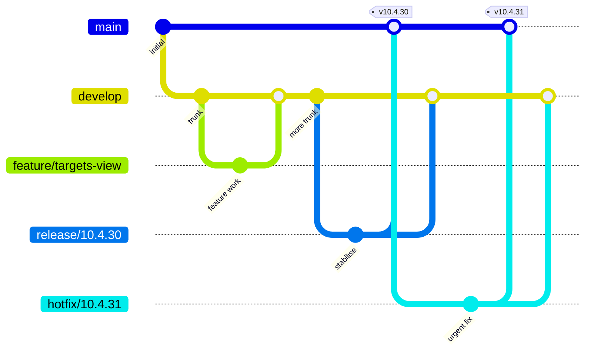
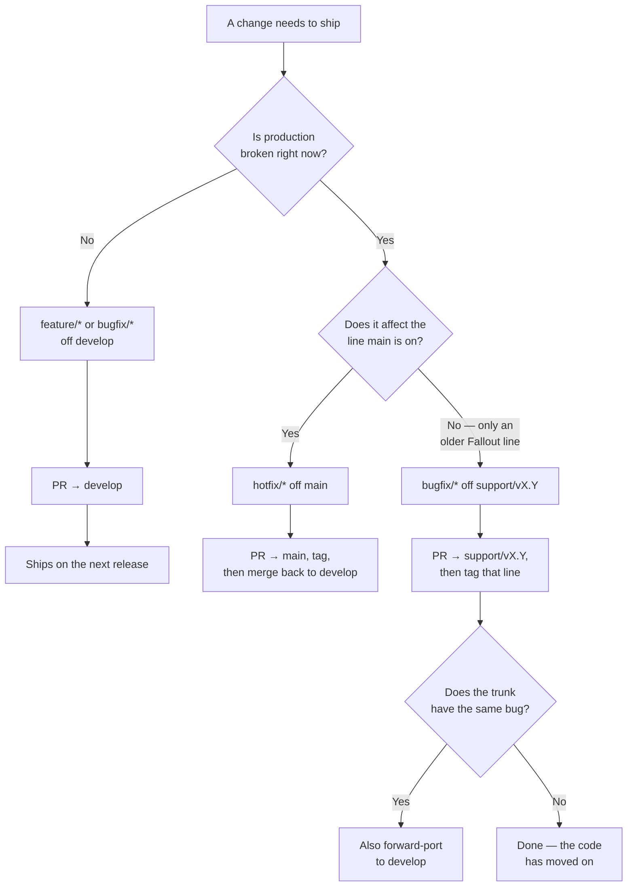

# Branching and release flow

How this repository branches, ships, and maintains older lines. The model is **GitFlow** as originally defined, plus long-lived `support/*` lines because the extension has to keep serving Fallout release lines that `main` has moved past.

> **Audience.** Anyone opening a PR needs the [Branches](#branches) table and [Where work lands](#where-work-lands). The rest is maintainer material — see [releasing.md](releasing.md) for the runbooks and [ci.md](ci.md) for what CI does at each step.

## Branches

| Branch | Purpose | Lifetime | Tagged? |
|---|---|---|---|
| `develop` | **Integration trunk. Default branch.** All finished work lands here first. Every push builds the [preview channel](releasing.md#the-preview-channel). | Permanent | No |
| `main` | **Production.** Only receives merges from `release/*` and `hotfix/*`, and every one of those is tagged. Never committed to directly. | Permanent | **Yes** |
| `release/*` | **Stabilisation window** for a release being prepared. Cut from `develop`; takes only fixes and release prep. Merges to `main` *and back to* `develop`, then deleted. | Short-lived | No (the merge into `main` is) |
| `hotfix/*` | **Urgent production fix.** Cut from `main`. Merges to `main` *and* `develop`, then deleted. | Short-lived | No (the merge into `main` is) |
| `support/vX.Y` | **Maintenance line** for an older Fallout release line still being served after `main` moved on — e.g. `support/v10.4` once `main` targets 10.5. Fixes only. | Permanent once cut | **Yes** |
| `feature/*`, `bugfix/*`, `chore/*`, `docs/*` | Working branches. | PR-and-merge, then deleted | No |

The two permanent branches are the point of the whole model: **`main` answers "what is in production" and `develop` answers "what is next"**, and they are always two refs you can diff.

`master` is not used. `support/*` is deliberately *not* called `release/*` — in GitFlow that prefix already means the temporary stabilisation branch, and overloading it makes every sentence about "the release branch" ambiguous.

## The flow



Note both merge-backs into `develop`. **Skipping either is the classic GitFlow mistake** — the fix ships to users and then vanishes on the next release, because the trunk never learned about it.

## Where work lands

Everything routine starts from `develop` and goes back to `develop`:

```bash
git switch develop && git pull --ff-only
git switch -c feature/my-change
# … work …
gh pr create --base develop --label enhancement
```

`develop` is the default branch, so `gh pr create` targets it without `--base`. Pass `--base` explicitly anyway when you mean `main` or a support line, so the intent is on the record.

One category label per PR (`enhancement`, `bug`, `breaking-change`, `security`, `documentation`, `dependencies`) or `skip-changelog` — the labels *are* the changelog, see [releasing.md](releasing.md#release-notes).

## Which branch does a fix belong on?



A `support/*` fix is **not** automatically forward-ported: those lines exist precisely because the trunk has moved on, so the same bug often doesn't exist there. Check rather than assume.

## Cutting a support line

`support/vX.Y` is cut **on demand, not preemptively** — the same rule Fallout applies to its production lines ([ADR-0007](https://github.com/Fallout-build/Fallout/blob/main/docs/adr/0007-cut-release-branch-on-demand.md)). A branch is created at the moment there is real work for it, not in anticipation.

For this repo the trigger is specific: **`main` retargets a newer Fallout release line while the previous one still needs serving.** The extension's `major.minor` track the framework line it targets ([releasing.md](releasing.md#versioning)), so moving `main` from 10.4 to 10.5 would otherwise abandon every user still on Fallout 10.4.

```bash
# main is about to move from Fallout 10.4 to the next line — preserve the 10.4 line first
git switch main && git pull --ff-only
git switch -c support/v10.4
git push -u origin support/v10.4
# then, on develop, retarget version.json + the pinned Fallout.Common together
```

There are **no support lines today**: `main` targets Fallout 10.4 and there is no newer line to move to. Nothing to cut yet.

## Protection

| | `develop` | `main` | `support/*` |
|---|---|---|---|
| PR required | yes | yes | yes |
| `ubuntu-latest` check | required | required | required |
| Code-owner review | `src/`, `plugins/` | same | same |
| Linear history | required | required | required |
| Force-push / delete | blocked | blocked | blocked |
| Admins exempt | yes | yes | yes |

Tags matching `v*` are covered by a repository ruleset: creation, deletion and updates are blocked for non-admins. That matters more here than in most repos — **every release channel is tag-triggered**, so an accidental tag is an accidental release.

Admins are deliberately exempt (`enforce_admins: false`), which keeps an escape hatch when a required check is stuck or production needs an urgent fix.

## Merging

**Merge commits are disabled** and linear history is enforced on every protected branch. Which of the two remaining methods to use depends on the direction:

| Merging | Method | Why |
|---|---|---|
| `feature/*` → `develop` | **Squash** | Working branches accumulate WIP. One commit per landed change keeps the trunk readable. |
| `develop` → `main` | **Rebase** | Squashing would collapse an entire release into a single commit on the production branch, losing the per-change history. |
| `release/*` → `main` | **Rebase** | Same, and the individual stabilisation commits are what you cherry-pick back to `develop`. |
| `hotfix/*` → `main` | **Rebase** | Same — you need a real commit to port back. |
| anything → `develop` (port-back) | **Squash** | It's a working branch like any other. |

GitHub can't enforce a method per branch, so this is discipline rather than configuration. Both methods stay enabled because both are correct somewhere.

### Why rebase across two long-lived branches is safe here

Rebase-merge rewrites commits, so `main` never becomes an ancestor of `develop` — and once a hotfix has landed on `main` and been ported back, the merge base falls behind both. The obvious worry is that the *next* release would try to replay commits already present on `main`.

It doesn't. `git rebase` detects already-applied commits by patch-id and drops them, so a second release replays only the genuinely new work. Verified rather than assumed: after a release, a hotfix on `main`, and a cherry-pick back to `develop`, a rebase of `develop` onto `main` listed three candidate commits and replayed exactly one.

The edge case to know: if a port-back was **conflict-resolved differently** from the original, its patch no longer matches and rebase will try to apply it again. That surfaces as a conflict at release time — visible and fixable, not silent.

### The double merge-back

A `release/*` or `hotfix/*` branch has to reach **two** branches. Because merge commits are disabled, the second one is a cherry-pick or a fresh PR rather than a literal merge — see [releasing.md](releasing.md#hotfix). The effect is what matters: a fix that never reaches `develop` ships once and then disappears on the next release.

We don't rely on `git branch --contains` anywhere except [tag validation](ci.md#publishyml), which checks reachability from `main` and `support/*` only — so the SHA divergence between the two branches costs us nothing.

## See also

- [ci.md](ci.md) — what runs, when, and why the publish workflow is hand-written
- [releasing.md](releasing.md) — versioning, channels, and every release runbook
- [Fallout's branching-and-release](https://github.com/Fallout-build/Fallout/blob/main/docs/branching-and-release.md) — the framework repo's model, which differs: it has no `develop`, and its `release/YYYY` lines are permanent production branches rather than stabilisation windows
