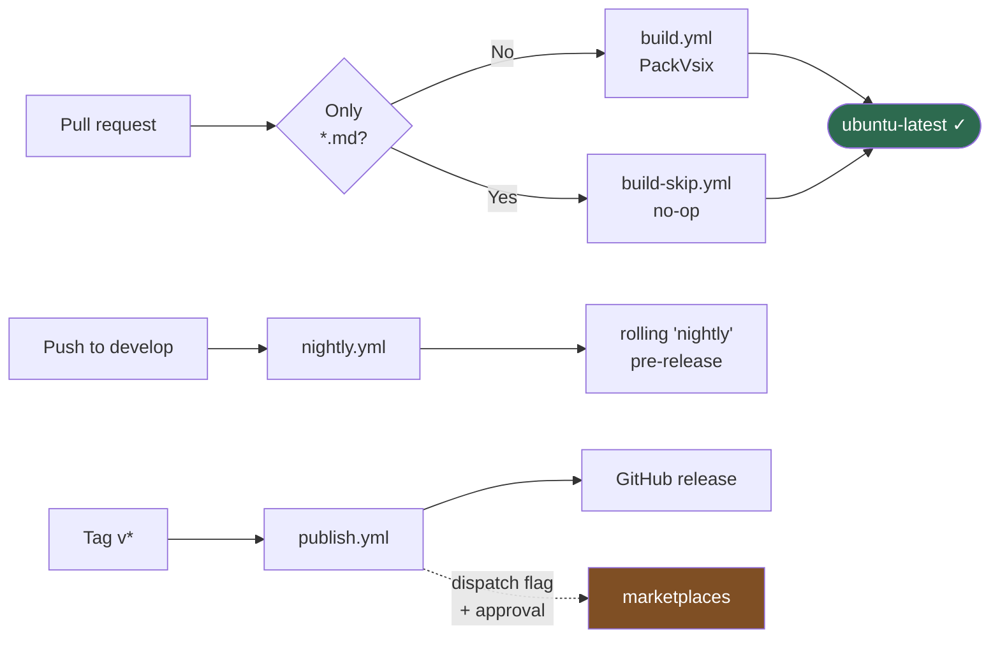
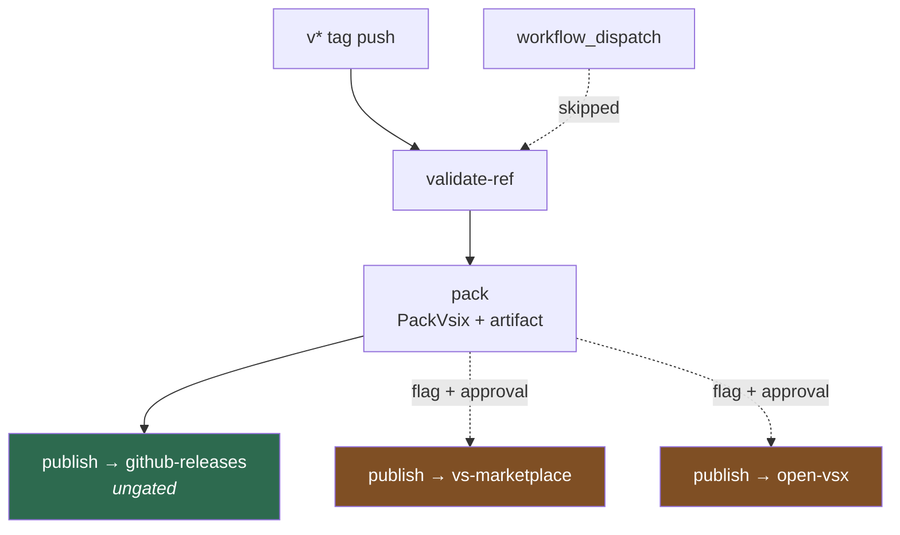

# CI

What runs, when, and why it's shaped this way.

The governing principle: **the build is defined in C#, not in YAML.** Every workflow here provisions toolchains and routes channels; every step that actually does something invokes a Fallout target from [`build/Build.cs`](../build/Build.cs) driving the [`Fallout.Vsce`](../plugins/Fallout.Vsce) plugin. That's why the same commands work identically on a laptop and on a runner.

## The workflows

| File | Trigger | Does | Generated? |
|---|---|---|---|
| `build.yml` | PR to `develop`, `main`, `support/*` | `PackVsix` — the required check | **Yes**, from `[GitHubActions]` |
| `build-skip.yml` | PR touching only `**/*.md` | Nothing; reports the same check | No |
| `nightly.yml` | push to `develop` | Packs, publishes the rolling `nightly` release | No |
| `publish.yml` | `v*` tag push, or dispatch | Packs, releases, optionally promotes to marketplaces | No |



## build.yml — the required check

Generated from the `[GitHubActions]` attribute in [`build/Build.CI.GitHubActions.cs`](../build/Build.CI.GitHubActions.cs). **Never hand-edit `.github/workflows/build.yml`** — edit the attribute and run `./build.ps1` (or `./build.sh`), which regenerates it. The file carries an `<auto-generated>` header saying so.

Branch protection requires a status check named **`ubuntu-latest`**. That's the *job* name, not the workflow name — protection keys on jobs, which is why the job is named after the image.

### build-skip.yml, and the trap it exists for

`build.yml` ignores `**/*.md`, so a docs-only PR doesn't burn CI on a build that can't be affected. But a required check that never reports leaves the PR **blocked forever** — GitHub waits for a check that will never arrive.

`build-skip.yml` fires on the exact inverse path set, does nothing, and reports success under the same `ubuntu-latest` context. Three things must stay in lockstep between the two files:

1. the job name (`ubuntu-latest`) — it *is* the status-check context;
2. the path sets, exact complements of one another;
3. the branch lists.

This is why `OnPullRequestExcludePaths` is a single `**/*.md` pattern. An earlier version used a negation carve-out (`!.github/workflows/**`), which made the complement impossible to state — and a gap between the two sets is exactly how a PR ends up permanently blocked.

A PR touching both a `.md` and a source file runs **both** workflows. Both report `ubuntu-latest`, both pass. That's fine.

## nightly.yml

Every push to `develop` packs a `.vsix`, uploads it as a per-run artifact, and replaces the asset on a rolling `nightly` GitHub pre-release. Details and rationale in [releasing.md](releasing.md#the-nightly-channel).

Two deliberate choices worth knowing when reading it:

- **Concurrency queues, never cancels.** A cancelled run could leave the release holding a half-uploaded asset.
- **The tag is `nightly`, which does not match `v*`.** So it neither triggers `publish.yml` nor falls under the `v*` tag-protection ruleset — necessary, because the workflow force-moves that tag on every push.
- **Never enable immutable releases on this repo.** An immutable release reserves its tag permanently, which a force-moved tag cannot survive; it burned the original `preview` name for good. If immutability is ever required, this channel has to move to per-commit tags.

## publish.yml

Hand-written, and it stays that way for two reasons the generator can't address:

1. It needs `actions/setup-node` with npm caching. The generator emits checkout, cache and setup-dotnet, with **no hook for extra steps**.
2. It fans out into per-channel jobs bound to GitHub Environments with approval gates, passing one artifact between them. The generator emits **one job per image** and has no concept of that.

The framework repo splits it the same way and for the same category of reason — generated CI, hand-written publish.



**`validate-ref`** confirms the tag is reachable from `main` or a `support/vX.Y` branch. Tags on `develop` are rejected: under GitFlow the trunk is never tagged for release — it ships through the nightly channel instead.

It runs only on tag pushes. On `workflow_dispatch` it's skipped by design, which is why every downstream job is guarded with `always() && needs.<job>.result == 'success'` rather than a bare dependency — a skipped job otherwise propagates through the graph and silently skips everything after it *while the run still reports success*.

The promotion jobs publish the exact artifact `pack` produced (`--skip PackVsix`) rather than rebuilding, so what gets approved is what ships.

## Running CI locally

There is no separate CI script. The runner invokes the same targets you do:

```bash
./build.ps1 PackVsix              # what the PR gate runs
dotnet fallout --plan             # what would run, without running it
dotnet fallout VerifyVsixCredentials   # proves marketplace tokens, publishes nothing
```

To run the extension itself rather than the build, see [developing.md](developing.md).

## Gotchas

- **`PublicRelease: true`** is set on any job that checks out a tag. A detached HEAD matches none of `version.json`'s branch refspecs, so without it Nerdbank.GitVersioning appends a git-height suffix and the marketplace version stops being a clean triple.
- **`fetch-depth: 0`** is required wherever the version is computed — NB.GV needs full history.
- **Boolean workflow inputs arrive as strings** from the REST API, and therefore from `gh workflow run`. Conditions compare against both `true` and `'true'`; a bare `== true` silently skips while reporting success.
