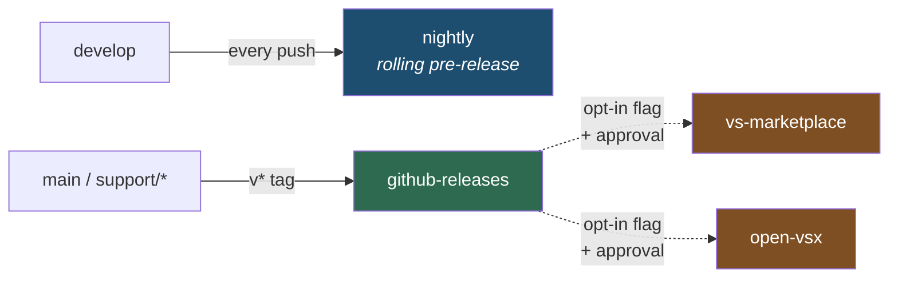
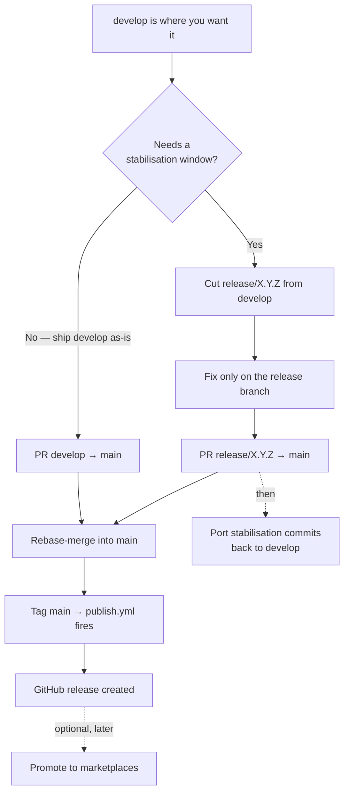

# Releasing

Versioning, channels, and the runbook for every kind of release. Branch model in [branching-and-release.md](branching-and-release.md); what CI does at each step in [ci.md](ci.md).

## Versioning

[Nerdbank.GitVersioning](https://github.com/dotnet/Nerdbank.GitVersioning) computes the version from `version.json`, the same as the framework repo.

- `version.json`'s `version` pins the **Fallout release line** this extension targets (`10.4`). The third component is the git height and moves on its own.
- The build **asserts** the declared line still matches the referenced `Fallout.Common`. Bumping one without the other fails the build rather than shipping a version that misstates what it targets.
- `versionHeightOffset` exists because height restarts when `version.json`'s `version` changes. Marketplace versions must increase monotonically, so the offset keeps the sequence moving forward.

```bash
dotnet nbgv get-version      # the number this commit would ship as
```

### Why release candidates aren't `-rc.N`

Both registries take **exactly three integers**. `vsce` refuses a semver prerelease outright:

> The VS Marketplace doesn't support prerelease versions

So an RC is an ordinary triple carrying a pre-release bit in the VSIX manifest (`Microsoft.VisualStudio.Code.PreRelease`), and `-rc.N` lives only on the git tag and the GitHub release.

**A version is pre-release or stable, never both.** Publishing `10.4.30` as a marketplace pre-release burns that number, forcing GA to `10.4.31`. Release candidates therefore stop at GitHub.

That argument does *not* apply to the [nightly channel](#the-nightly-channel): the patch is a git height, so every build already has a unique number and stable is always a later height. Nothing gets consumed that a stable release wants.

## Channels



| Channel | Trigger | Gating |
|---|---|---|
| `nightly` (rolling) | every push to `develop` | none |
| `github-releases` | any `v*` tag | none |
| `vs-marketplace` | dispatch opt-in flag | flag + approval |
| `open-vsx` | dispatch opt-in flag | flag + approval |

**A tag push never reaches a marketplace.** Promotion is deliberate: set the flag, then approve the environment — two independent layers, matching how Fallout gates nuget.org.

## The nightly channel

Every push to `develop` builds a `.vsix`, uploads it as a per-run workflow artifact, and replaces the asset on a rolling `nightly` GitHub pre-release.

> Named `preview` until GitHub's immutable releases were briefly enabled here. An immutable release reserves its tag **permanently** — deleting the release and the tag does not free the name — so `preview` is unusable in this repo forever. Keep immutable releases off: a rolling tag and immutability cannot coexist, and the next name would burn the same way.

Both, deliberately: the release asset has a **stable URL** and is what you install from, but the next push replaces it — so the per-run artifact is the fixed record of what a given commit produced.

```bash
gh release download nightly -R Fallout-build/Fallout.Extensions.VSCode -p '*.vsix' --clobber
code --install-extension fallout.vsix --force
```

Installing is a manual step by design; the build never touches your editor. VS Code only auto-updates extensions it obtained from a gallery, so this is a one-shot install — see [#6](https://github.com/Fallout-build/Fallout.Extensions.VSCode/issues/6) for the self-hosted-gallery idea that would change that.

## Cutting a release



### Simple release — nothing to stabilise

```bash
git switch develop && git pull --ff-only
gh pr create --base main --title "Release" --label skip-changelog
# merge with REBASE (see below), then:
git switch main && git pull --ff-only
dotnet nbgv get-version          # confirm the number
gh release create v10.4.30 --target main --generate-notes
```

### With a stabilisation window

```bash
git switch -c release/10.4.30 develop
git push -u origin release/10.4.30
# … fixes land here by PR, feature work continues on develop …
gh pr create --base main
# merge, tag as above, then port the stabilisation commits back:
git switch -c chore/port-10.4.30 develop
git cherry-pick <fix-sha>…
gh pr create --base develop
```

### Release candidate

```bash
gh release create v10.4.30-rc.1 --target main --prerelease --generate-notes
```

The tag must match the version `nbgv` computes for that commit — the workflow packages from the checked-out tag, not from the tag name, so a mismatch ships a `.vsix` whose version disagrees with its release.

> **Merge with rebase, not squash, into `main`.** Squashing collapses a whole release into one commit, losing the per-change history on the production branch. Merge commits are disabled and linear history is enforced, so rebase is the option that keeps commits intact. Repeated rebase-merges stay clean across releases — `git rebase` drops already-applied commits by patch-id. Full reasoning and the one edge case in [branching-and-release.md](branching-and-release.md#merging).

> **"Merge back to develop" is a cherry-pick or a second PR here**, not a literal merge. GitFlow assumes merge commits; this repo enforces linear history. The effect is the same — the fix must reach `develop`, or it ships to users and then disappears on the next release — but the mechanism is a PR carrying the same changes.

## Hotfix

Production is broken and it can't wait for the next release.

```bash
git switch main && git pull --ff-only
git switch -c hotfix/10.4.31
# … fix …
gh pr create --base main --label bug
# merge, then:
gh release create v10.4.31 --target main --generate-notes
```

Then get it onto the trunk — **this step is not optional**:

```bash
git switch -c bugfix/port-10.4.31 develop
git cherry-pick <fix-sha>
gh pr create --base develop --label skip-changelog
```

## Releasing from a support line

`support/vX.Y` serves an older Fallout line. Tags on it fire the same pipeline — `validate-ref` accepts `main` and `support/vX.Y`.

```bash
git switch support/v10.4 && git pull --ff-only
# … fix lands by PR …
gh release create v10.4.99 --target support/v10.4 --generate-notes
```

Whether to forward-port is a judgement call: those lines exist because the trunk moved on, so the same bug often doesn't exist there. Check, don't assume.

## Promoting to the marketplaces

Nothing reaches a marketplace from a tag. Promotion is an explicit act:

```bash
gh workflow run publish.yml -f tag=v10.4.30 -f publish-to-marketplaces=true
```

Both `vs-marketplace` and `open-vsx` then pause for approval on the run page (*Review deployments*). Approve each. The job publishes the exact artifact the `pack` job produced (`--skip PackVsix`), not a rebuild.

You can rehearse the wiring without burning a release: set the flag, wait for the approval prompt, then cancel without approving.

## If a publish fails partway

Both CLIs are invoked with `--skip-duplicate`, so re-running is idempotent on whatever already landed:

```bash
gh workflow run publish.yml -f tag=v10.4.30 -f publish-to-marketplaces=true
```

## Release notes

Generated by GitHub from merged PR labels — the taxonomy lives in [`.github/release.yml`](../.github/release.yml) and matches the framework repo's. Apply one category label per PR (`enhancement`, `bug`, `breaking-change`, `security`, `documentation`, `dependencies`), or `skip-changelog` for housekeeping.

There is **no `CHANGELOG.md`**. The labels are the changelog: a hand-maintained file would duplicate them, and its version heading can't be written correctly in advance since the patch is a git height not settled until the release is cut. If the marketplace page ever needs a rendered changelog, generate it into the `.vsix` at pack time rather than reinstating a tracked file.

## Tokens

| Secret | Used by | Scope |
|---|---|---|
| `VSCE_PAT` | `vs-marketplace` | Azure DevOps PAT, Marketplace > Manage |
| `OVSX_TOKEN` | `open-vsx` | Open VSX access token (mapped to `OVSX_PAT`) |

Both are read from the environment by the CLIs, never passed as process arguments. Verify without publishing:

```bash
dotnet fallout VerifyVsixCredentials
```
